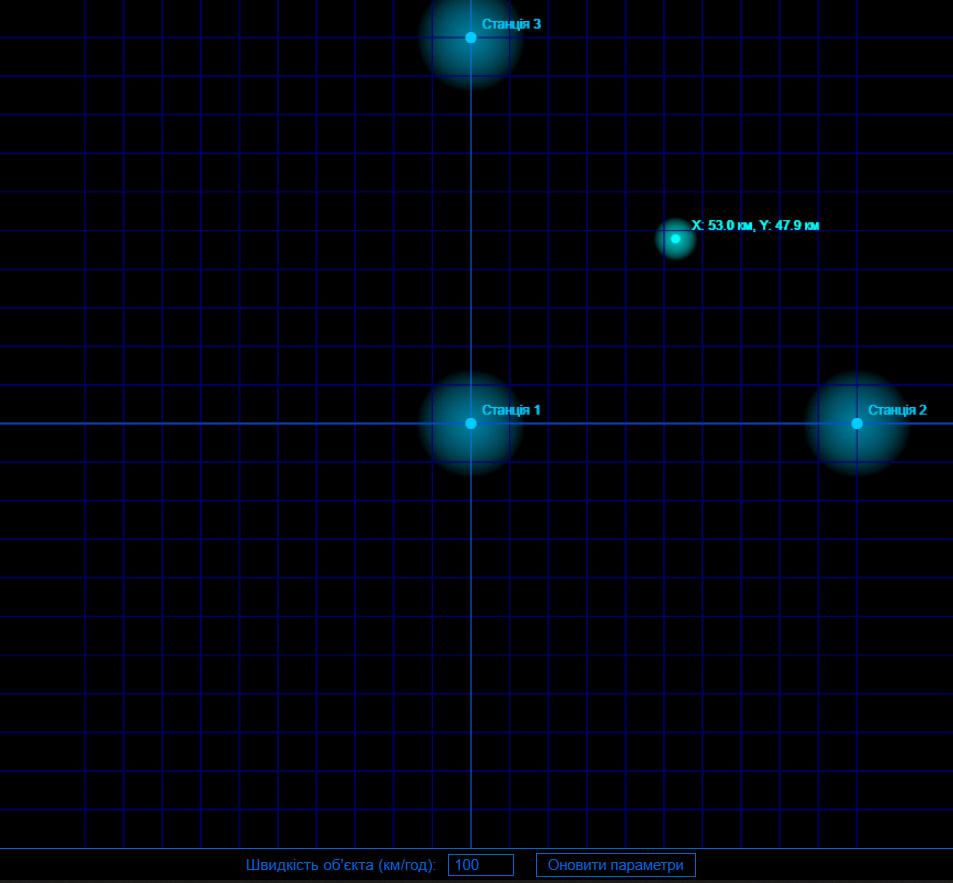
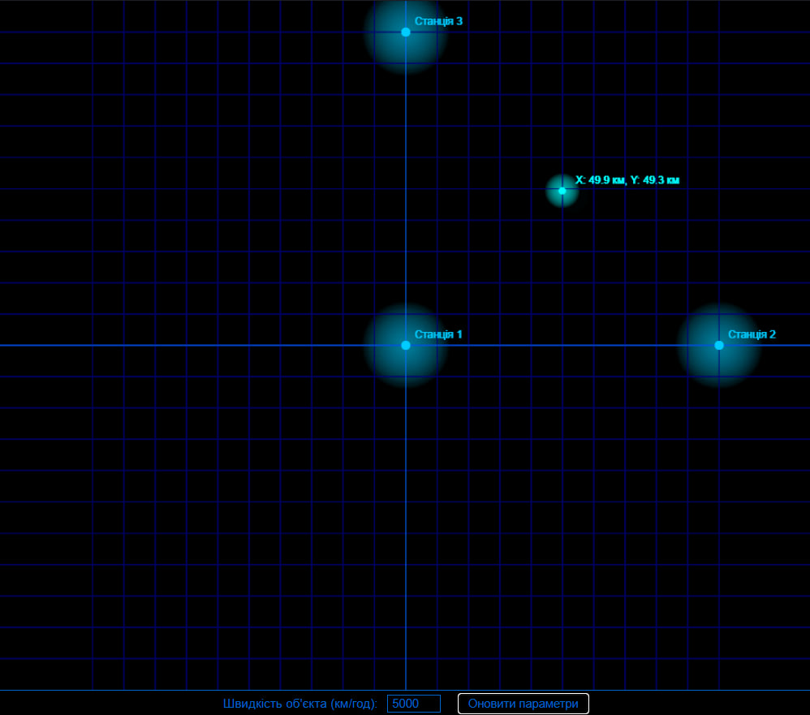

# Лабораторна робота №6: Розробка додатку для візуалізації вимірювань LORAN
## Посилання

[Демонстрація роботи системи на CodePen](https://codepen.io/VolodimirProdan/full/yyBJZaj)
## Мета роботи
Розробити додаток, який зчитує дані з емульованої вимірювальної частини LORAN, наданої у вигляді Docker image, та відображає положення об'єкта і базових станцій на графіку в декартових координатах.

## Теоретичні відомості
LORAN (Long Range Navigation) — це система гіперболічної навігації, яка використовує різниці часу прибуття сигналів (TDoA) від декількох базових станцій для визначення місцезнаходження об'єкта. Система використовує метод гіперболічного позиціювання, який базується на вимірюванні різниць часу прибуття сигналів від об'єкта до кількох приймачів, розташованих у відомих точках.

## Практична реалізація
Програму реалізовано як веб-додаток з використанням сучасних веб-технологій. В основі системи лежить алгоритм обчислення положення об'єкта за допомогою методу найменших квадратів та градієнтного спуску. Візуалізація здійснюється за допомогою HTML Canvas та Plotly, що забезпечує наочне представлення розташування об'єкта відносно базових станцій.

На рисунку 1 показано роботу системи з трьома опорними станціями LORAN. За допомогою різниці часу прибуття сигналів (TDoA) система успішно визначає положення об'єкта на основі даних від кожної станції.

  
   
  <em>Рис. 1 - Визначення положення об'єкта за допомогою системи LORAN</em>

На рисунку 2 продемонстровано роботу системи після зміни параметра швидкості об'єкта. Система продовжує коректно відстежувати положення об'єкта при його русі з новою швидкістю.

  
   
  <em>Рис. 2 - Відстеження об'єкта при зміненій швидкості руху</em>

Для кращої демонстрації роботи системи та можливості взаємодії з параметрами в реальному часі рекомендується відвідати [інтерактивну версію](https://codepen.io/VolodimirProdan/full/yyBJZaj) проекту на CodePen.

## Висновки
У результаті виконання лабораторної роботи була створена функціональна система візуалізації вимірювань LORAN. Розроблений веб-додаток забезпечує підключення до емульованої вимірювальної частини через WebSocket, обробку даних про час прибуття сигналів і обчислення положення об’єкта за методом гіперболічного позиціювання. Він також візуалізує розташування об’єкта та базових станцій на графіку й дозволяє змінювати параметри руху об’єкта через API.

